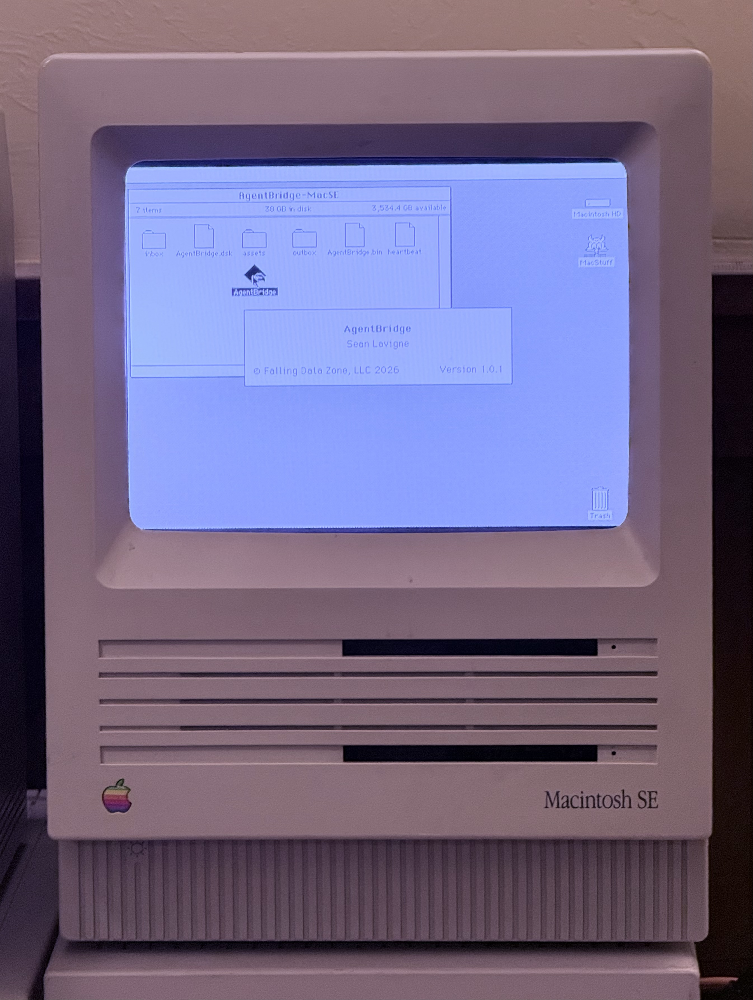
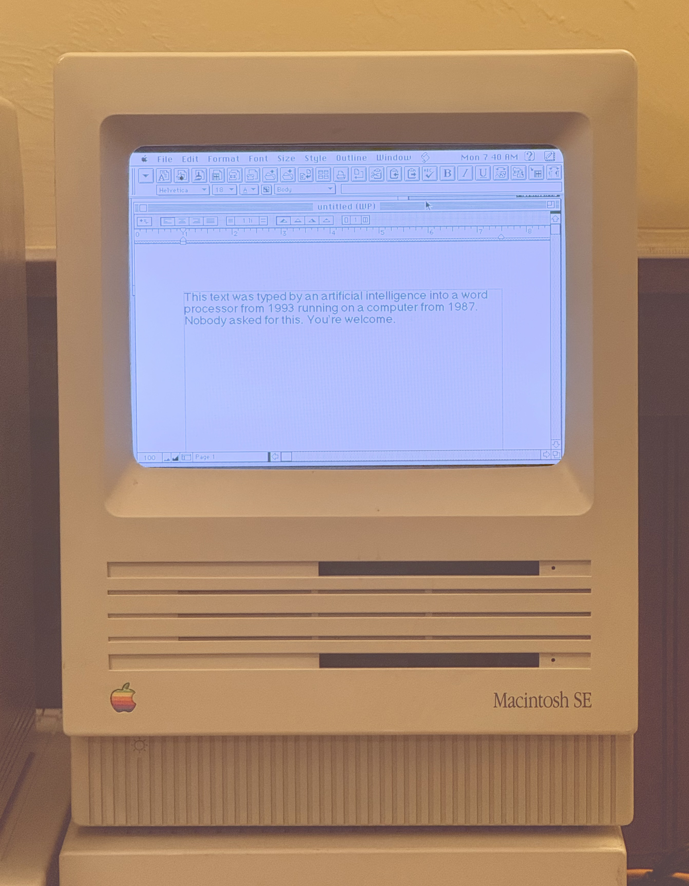

# AgentBridge

[](https://www.npmjs.com/package/classic-mac-mcp) [](https://registry.modelcontextprotocol.io/servers/io.github.SeanFDZ/agentbridge)

**Let AI talk to your Classic Mac.**

AgentBridge is a native Classic Mac OS application that lets AI agents (like Claude) interact with Mac OS 7–9 through structured commands and responses. It works on real hardware and emulators — no modifications to your Mac required.

Drop AgentBridge into a shared folder, launch it on your Mac, and an AI agent can list windows, open apps, type text, read the clipboard, browse files, and more — all through a simple text-based protocol.

<p align="center">
  
</p>

## How It Works

```
┌──────────────────────┐
│    Claude / AI Agent │
│         │            │
│    MCP Protocol      │
│         │            │
│    MCP Server (Node) │
│         │            │
│    Shared Folder I/O │
└────────┬─────────────┘
         │  reads/writes text files
         │
    ┌────┴──────────────────────────┐
    │  Shared Volume (NAS / AFP /   │
    │  SMB / emulator extfs)        │
    │                               │
    │  AgentBridge-MyMac/           │
    │  ├── inbox/   ← commands in   │
    │  ├── outbox/  ← responses out │
    │  ├── assets/  ← file staging  │
    │  └── heartbeat                │
    └────┬──────────────────────────┘
         │
┌────────┴─────────────────────────┐
│  Classic Mac OS 7 / 8 / 9        │
│                                  │
│  AgentBridge.app                 │
│  - Polls inbox for commands      │
│  - Executes via Mac Toolbox      │
│  - Writes responses to outbox    │
│  - Heartbeat every 2 seconds     │
└──────────────────────────────────┘
```

The transport is just a folder. How that folder is shared between the AI and the Mac is up to you:

- **NAS/file server** (AFP or SMB) — multiple Macs and your modern computer all mount the same share
- **Emulator shared folder** — BasiliskII and SheepShaver both support host directory sharing
- **Any other shared filesystem** — if both sides can read and write files, it works

No SSH. No special drivers. No modifications to your Mac's system. AgentBridge is a regular application — launch it, quit it, done.

## MCP Tools Reference

The MCP server exposes these tools to AI agents. If the fleet has only one target, the `target` parameter is optional on all tools.

### System & Status

**`classic_mac_list_targets`**
List all configured Classic Mac targets and their status (heartbeat alive/dead).
No parameters.

**`classic_mac_ping`**
Health check — returns `pong` if AgentBridge is responding.
| Parameter | Required | Description |
|-----------|----------|-------------|
| `target` | No | Target ID or alias |

**`classic_mac_heartbeat`**
Read the heartbeat file — shows uptime, front app, free memory, timestamp.
| Parameter | Required | Description |
|-----------|----------|-------------|
| `target` | No | Target ID or alias |

**`classic_mac_get_about`**
System information — OS version, machine type, RAM, free memory, uptime.
| Parameter | Required | Description |
|-----------|----------|-------------|
| `target` | No | Target ID or alias |

### Windows & Processes

**`classic_mac_list_windows`**
Enumerate all visible windows across all applications. Returns window index, title, bounds (left,top,right,bottom), and front/back layer.
| Parameter | Required | Description |
|-----------|----------|-------------|
| `target` | No | Target ID or alias |

**`classic_mac_get_front_window`**
Get details about the frontmost window — title, bounds, owning app.
| Parameter | Required | Description |
|-----------|----------|-------------|
| `target` | No | Target ID or alias |

**`classic_mac_list_processes`**
List running applications with name, creator code, PID, and memory partition.
| Parameter | Required | Description |
|-----------|----------|-------------|
| `target` | No | Target ID or alias |

### Menus

**`classic_mac_list_menus`**
List the menu bar entries for the frontmost application.
| Parameter | Required | Description |
|-----------|----------|-------------|
| `target` | No | Target ID or alias |

**`classic_mac_get_menu_items`**
Get items within a specific menu by name.
| Parameter | Required | Description |
|-----------|----------|-------------|
| `target` | No | Target ID or alias |
| `menu` | Yes | Menu title (e.g. "File", "Edit") |

**`classic_mac_menu_select`**
Activate a menu item by name. Works for items with keyboard shortcuts.
| Parameter | Required | Description |
|-----------|----------|-------------|
| `target` | No | Target ID or alias |
| `menu` | Yes | Menu title |
| `item` | Yes | Menu item name |

### Mouse & Keyboard

**`classic_mac_click`**
Click at screen coordinates.
| Parameter | Required | Description |
|-----------|----------|-------------|
| `target` | No | Target ID or alias |
| `x` | Yes | X coordinate (pixels from left) |
| `y` | Yes | Y coordinate (pixels from top) |
| `clicks` | No | Number of clicks (default 1, use 2 for double-click) |

**`classic_mac_mouse_move`**
Move the cursor without clicking.
| Parameter | Required | Description |
|-----------|----------|-------------|
| `target` | No | Target ID or alias |
| `x` | Yes | X coordinate |
| `y` | Yes | Y coordinate |

**`classic_mac_mouse_drag`**
Click and drag from one point to another.
| Parameter | Required | Description |
|-----------|----------|-------------|
| `target` | No | Target ID or alias |
| `x1` | Yes | Start X |
| `y1` | Yes | Start Y |
| `x2` | Yes | End X |
| `y2` | Yes | End Y |

**`classic_mac_type_text`**
Type a string of text into the frontmost application.
| Parameter | Required | Description |
|-----------|----------|-------------|
| `target` | No | Target ID or alias |
| `text` | Yes | Text to type |

**`classic_mac_key_press`**
Press a single key with optional modifiers.
| Parameter | Required | Description |
|-----------|----------|-------------|
| `target` | No | Target ID or alias |
| `key` | Yes | Key name: single character, or `return`, `enter`, `tab`, `space`, `delete`, `escape`, `left`, `right`, `up`, `down`, `home`, `end`, `pageup`, `pagedown`, `f1`–`f5` |
| `modifiers` | No | Comma-separated: `cmd`, `opt`, `shift`, `ctrl` (e.g. `"cmd,shift"`) |

### Clipboard

**`classic_mac_get_clipboard`**
Read the current clipboard text contents.
| Parameter | Required | Description |
|-----------|----------|-------------|
| `target` | No | Target ID or alias |

**`classic_mac_set_clipboard`**
Set the clipboard text contents.
| Parameter | Required | Description |
|-----------|----------|-------------|
| `target` | No | Target ID or alias |
| `text` | Yes | Text to place on clipboard |

### Application Control

**`classic_mac_launch_app`**
Launch an application by HFS path or creator code.
| Parameter | Required | Description |
|-----------|----------|-------------|
| `target` | No | Target ID or alias |
| `path` | No* | HFS path (e.g. `"Macintosh HD:Applications:SimpleText"`) |
| `creator` | No* | 4-character creator code (e.g. `"ttxt"`) |

*One of `path` or `creator` is required.

**`classic_mac_activate_app`**
Bring a running application to the front.
| Parameter | Required | Description |
|-----------|----------|-------------|
| `target` | No | Target ID or alias |
| `name` | Yes | Application name |

**`classic_mac_quit_app`**
Send a quit Apple Event to a running application.
| Parameter | Required | Description |
|-----------|----------|-------------|
| `target` | No | Target ID or alias |
| `name` | Yes | Application name |

**`classic_mac_send_appleevent`**
Send a generic Apple Event to a running application.
| Parameter | Required | Description |
|-----------|----------|-------------|
| `target` | No | Target ID or alias |
| `app` | Yes | Target app name or 4-char creator code |
| `event` | Yes | Event type: `oapp`, `quit` |

### Files & Volumes

**`classic_mac_get_volumes`**
List all mounted volumes with name, free space, and total size.
| Parameter | Required | Description |
|-----------|----------|-------------|
| `target` | No | Target ID or alias |

**`classic_mac_list_folder`**
List contents of a folder by HFS path. Returns name, type code, creator code, size, and whether each item is a folder.
| Parameter | Required | Description |
|-----------|----------|-------------|
| `target` | No | Target ID or alias |
| `path` | Yes | HFS path (e.g. `"Macintosh HD:System Folder:"`) |

## Compatibility

| Environment | Architecture | OS Versions | Status |
|-------------|-------------|-------------|--------|
| 68k Macs | 68k | System 7.0–8.1 | ✅ Tested on System 7.6.1  |
| PowerPC Macs | PowerPC | Mac OS 8.5–9.2.2 | Builds, untested |
| BasiliskII | 68k | System 7.0–8.1 | ✅ Tested on System 7.6.1 |
| SheepShaver | PowerPC | Mac OS 8.5–9.2.2 | Builds, untested |


AgentBridge requires System 7.0 or later (for Apple Events support).

## Quick Start

### Pre-built Binaries

Download from the [Releases](../../releases) page:

- **`AgentBridge-68k.bin`** — MacBinary for 68k Macs (System 7–8.1)
- **`AgentBridge-68k.dsk`** — HFS disk image for 68k Macs (System 7–8.1)
- **`AgentBridge-ppc.bin`** — MacBinary for PowerPC Macs (OS 8.5–9.2.2)
- **`AgentBridge-ppc.dsk`** — HFS disk image for PowerPC Macs (OS 8.5–9.2.2)

### Setup

1. **Create a shared folder** accessible to both your Mac and your modern computer. This can be a NAS share, an emulator's host directory, or any shared filesystem.

2. **Create the directory structure** inside the shared folder:
   ```
   AgentBridge/
   └── AgentBridge-YourMacName/
       ├── inbox/
       ├── outbox/
       └── assets/
   ```

3. **Copy AgentBridge** into the folder alongside inbox/outbox/assets.

4. **Launch AgentBridge** on the Classic Mac. It will automatically find its folder and start polling for commands.

5. **Send a test command** from your modern computer:
   ```bash
   printf "BRIDGE 1.0.1\rSEQ 00001\rCMD ping\rTS 20260308T170000\r---\r" > /path/to/shared/AgentBridge-YourMacName/inbox/C00001.msg
   ```

6. **Read the response:**
   ```bash
   cat /path/to/shared/AgentBridge-YourMacName/outbox/R00001.msg | tr '\r' '\n'
   ```

   You should see `RESULT pong` and `STATUS ok`.

<p align="center">
  
</p>

### Multiple Macs

Each Mac gets its own subfolder with its own copy of AgentBridge:

```
NAS Share/
└── AgentBridge/
    ├── AgentBridge-SE30/          ← Mac SE/30 running System 7
    │   ├── AgentBridge (app)
    │   ├── inbox/
    │   ├── outbox/
    │   └── assets/
    ├── AgentBridge-G4/            ← Power Mac G4 running OS 9
    │   ├── AgentBridge (app)
    │   ├── inbox/
    │   ├── outbox/
    │   └── assets/
    └── AgentBridge-BasiliskII/    ← Emulator
        ├── AgentBridge (app)
        ├── inbox/
        ├── outbox/
        └── assets/
```

AgentBridge uses its own launch location as its working directory — no configuration needed.

## MCP Server

The MCP server exposes AgentBridge commands as tools for AI agents like Claude. It's a Node.js TypeScript server that communicates via stdio (standard MCP transport).

### Install via npm

```bash
npm install -g classic-mac-mcp
```

Or run directly with npx (no install needed):

```bash
npx -y classic-mac-mcp --config /path/to/fleet.json
```

### Install from source

```bash
git clone https://github.com/SeanFDZ/agentbridge.git
cd agentbridge
npm install
npm run build
```

### Configuration

Create a `fleet.json` file to point at your shared folders:

```json
{
  "fleet": [
    {
      "id": "my-classic-mac",
      "alias": "Classic Mac",
      "arch": "68k",
      "os_version": "7.6.1",
      "shared_folder": "/Volumes/NASShare/AgentBridge/AgentBridge-MyMac"
    }
  ]
}
```

### Claude Desktop

Add to your Claude Desktop config (`claude_desktop_config.json`):

```json
{
  "mcpServers": {
    "classic-mac": {
      "command": "npx",
      "args": ["-y", "classic-mac-mcp", "--config", "/path/to/fleet.json"]
    }
  }
}
```

Or if you installed from source:

```json
{
  "mcpServers": {
    "classic-mac": {
      "command": "node",
      "args": ["/path/to/agentbridge/dist/server.js", "--config", "/path/to/agentbridge/config/fleet.json"]
    }
  }
}
```

## Protocol

AgentBridge uses a line-oriented key-value text protocol designed for Classic Mac constraints:

- No JSON — parseable with ~50 lines of C, zero dynamic memory allocation
- CR line endings (Classic Mac native)
- MacRoman text encoding (translated to UTF-8 by the MCP server)
- 32KB max message size
- Files named `C00001.msg` (commands) and `R00001.msg` (responses)

### Command Format

Commands are text files written to the `inbox/` directory, named `C{seq}.msg` (e.g. `C00001.msg`). Sequence numbers are zero-padded to 5 digits.

```
BRIDGE 1.0.1
SEQ 00042
CMD list_windows
TS 20260308T153022
---
```

All lines are `KEY value` pairs, terminated by `---` on its own line. Line endings are CR (0x0D, Classic Mac native). Text encoding is MacRoman (the MCP server handles UTF-8 conversion). Multi-line text uses `+` continuation lines after the `TEXT` key. Maximum message size is 32KB.

### Response Format

Responses appear in the `outbox/` directory as `R{seq}.msg`, matching the command's sequence number. AgentBridge deletes command files after processing; the MCP server deletes response files after reading.

```
BRIDGE 1.0.1
SEQ 00042
STATUS ok
COUNT 2
WINDOW 1|?|Untitled|10,40,400,300|front
WINDOW 2|?||0,0,640,480|back
TS 20260308T153022
---
```

`STATUS` is either `ok` or `error`. On error, `ERRCODE` and `ERRMSG` fields provide details. Multi-value responses (windows, processes, volumes, files, menu items) use repeated keys (`WINDOW`, `PROCESS`, `VOLUME`, `FILEENTRY`, `MENUBAR`, `MENUITEM`) with pipe-delimited fields.

### Heartbeat

AgentBridge writes a `heartbeat` file in its working directory every ~2 seconds:

```
BRIDGE 1.0.1
UPTIME 218
TICKS 240498
FRONTAPP Finder
FREEMEM 4096
TS 20260308T173113
---
```

The MCP server monitors the heartbeat file's modification time to determine if AgentBridge is alive.

## Building from Source

```bash
git clone https://github.com/SeanFDZ/agentbridge.git
cd agentbridge
npm install
npm run build
```

Requires Node.js 20+.

AgentBridge binaries are available as pre-built downloads — source code is not distributed.

## Project Structure

```
agentbridge/
├── src/                            # MCP server (TypeScript, GPLv3)
│   ├── server.ts                   # MCP tool definitions and handlers
│   ├── fleet.ts                    # Fleet registry
│   ├── types.ts                    # Type definitions
│   └── bridge/
│       └── client.ts               # Shared folder I/O client
└── config/
    └── fleet.json                  # Fleet configuration
```

## Design Principles

**No host-side dependencies.** AgentBridge does everything through the Mac Toolbox. There's no SSH, no screen capture, no input injection at the host OS level. This means it works identically on real hardware and emulators.

**No system modifications.** AgentBridge is a regular application. It doesn't modify your System Folder, install extensions, or change boot configuration. Launch it, quit it, delete it — your Mac is untouched.

**Transport agnostic.** The protocol is just text files in a folder. How that folder is shared (NAS, AFP, SMB, emulator extfs, USB drive, carrier pigeon) is not AgentBridge's concern.

**Cooperative multitasking citizen.** AgentBridge yields CPU via `WaitNextEvent()` every cycle. Other apps run normally.

**Stateless commands.** Every command is self-contained. The MCP server can crash and restart without the Mac side needing to know.

## Credits

AgentBridge 1.0.1
Sean Lavigne
© 2026 Falling Data Zone, LLC

Built with [Retro68](https://github.com/autc04/Retro68) by Wolfgang Thaller.

## License

This project has two components with separate licenses:

**MCP Server** (TypeScript, `src/` directory) — [GNU General Public License v3.0](LICENSE) — free to use, modify, and distribute under GPL terms.

**AgentBridge.app** (Classic Mac application) — © 2026 Falling Data Zone, LLC. All rights reserved. Pre-built binaries are available for download.

**Protocol** — the AgentBridge protocol as documented in this README is open.
